# Kubernetes


---

# Prácticas de Kubernetes

Repositorio de prácticas progresivas sobre Kubernetes: desde el despliegue local con Minikube hasta un clúster K3s en alta disponibilidad con stack de observabilidad completo.

## Índice

- [Práctica 1 · Hello Minikube](#práctica-1--hello-minikube)
- [Práctica 2 · Kubernetes Basics](#práctica-2--kubernetes-basics)
- [Práctica 3 · PoC K3s HA Cluster](#práctica-3--poc-k3s-ha-cluster)
- [Anexo · Deploy alternativo con k3d](#anexo--deploy-alternativo-con-k3d)

---

## Práctica 1 · Hello Minikube

> Introducción a Kubernetes desplegando una aplicación de ejemplo, exponiéndola como servicio, validando el Dashboard gráfico y explorando el addon de métricas.

Referencia: https://kubernetes.io/docs/tutorials/hello-minikube/

---

### 1. Iniciar el clúster

```bash
minikube start --driver=docker
minikube status
```

Arranca un clúster de un solo nodo usando Docker como hipervisor. `minikube status` confirma que el control plane está operativo.

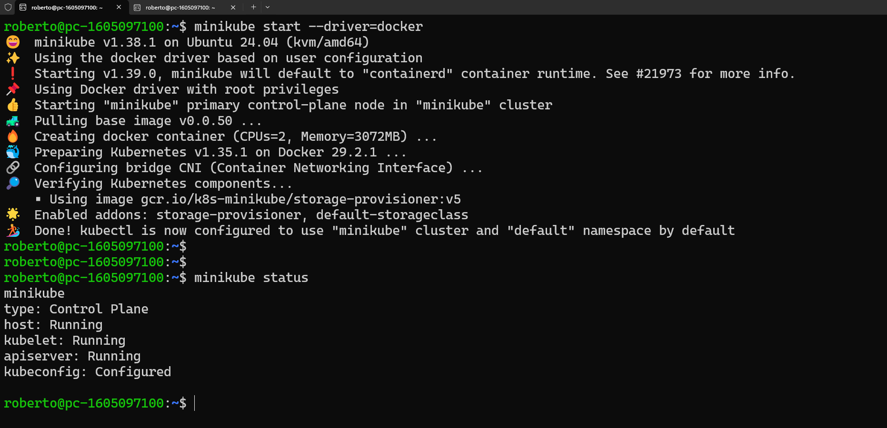

---

### 2. Crear el Deployment

```bash
kubectl create deployment hello-node \
  --image=registry.k8s.io/e2e-test-images/agnhost:2.53 \
  -- /agnhost netexec --http-port=8080
kubectl get pods
```

Crea un Deployment que lanza un pod con la imagen `agnhost`, configurada para servir HTTP en el puerto 8080. El flag `--` separa los argumentos de kubectl de los del contenedor.

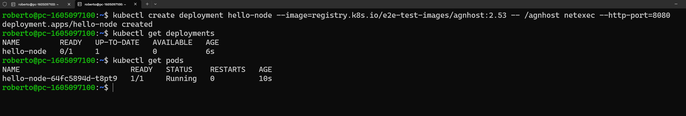

---

### 3. Exponer el servicio

```bash
kubectl expose deployment hello-node --type=LoadBalancer --port=8080
kubectl get services
minikube service hello-node --url
```

`LoadBalancer` sería el tipo habitual en cloud. En Minikube, `minikube service --url` hace de proxy local y devuelve la URL accesible desde el host.

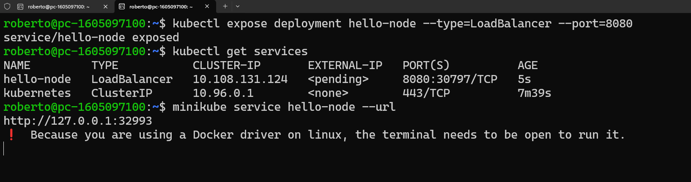

---

### 4. Kubernetes Dashboard

```bash
minikube dashboard --url
```

Habilita el addon del Dashboard y abre un proxy hacia su interfaz web, que permite inspeccionar recursos del clúster visualmente.

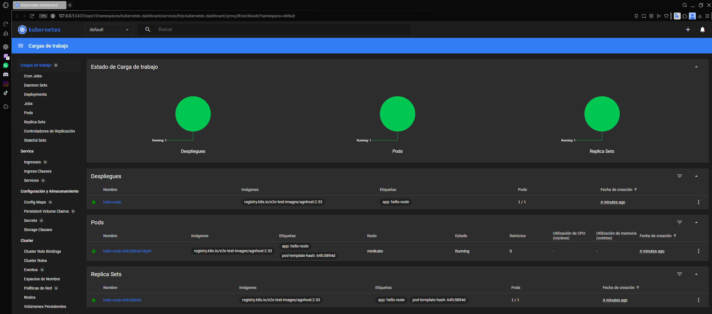

---

### 5. Verificar el servicio

```bash
curl http://127.0.0.1:32993
```

Petición directa al NodePort expuesto. La respuesta confirma que el pod está sirviendo tráfico correctamente.

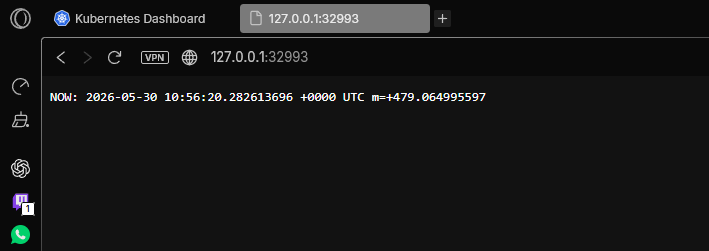

---

### 6. Addon metrics-server

```bash
minikube addons enable metrics-server
kubectl get pod,svc -n kube-system
```

Habilita el recolector de métricas del clúster, necesario para comandos como `kubectl top`. Se verifica que el pod arranca en el namespace `kube-system`.

---

## Práctica 2 · Kubernetes Basics

> Fundamentos de Kubernetes en 6 módulos: despliegue, exploración de pods, exposición de servicios, escalado horizontal, rolling updates y rollback.

Referencia: https://kubernetes.io/docs/tutorials/kubernetes-basics/

---

### 1. Iniciar clúster y verificar nodo

```bash
minikube start --driver=docker
kubectl get nodes
```

`get nodes` muestra el estado del nodo de control plane. En Minikube siempre hay uno solo, con rol `control-plane`.

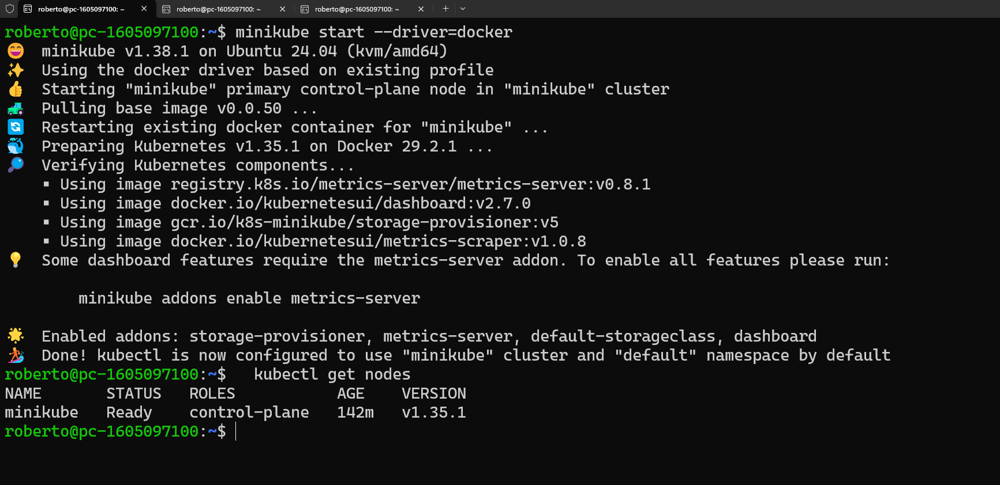

---

### 2. Crear el Deployment

```bash
kubectl create deployment kubernetes-bootcamp \
  --image=gcr.io/google-samples/kubernetes-bootcamp:v1
kubectl get deployments
```

Despliega la aplicación de ejemplo del tutorial oficial. `get deployments` muestra cuántas réplicas están listas frente a las deseadas.

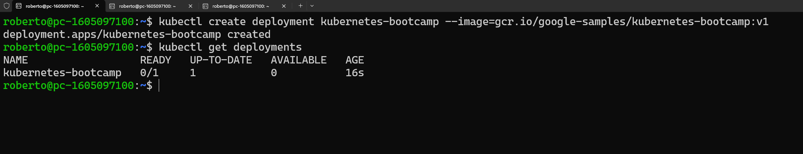

---

### 3. Explorar el Pod

```bash
export POD_NAME=$(kubectl get pods -o go-template \
  --template '{{range .items}}{{.metadata.name}}{{"\n"}}{{end}}')
kubectl logs $POD_NAME
```

La plantilla Go-template extrae solo el nombre del pod de la respuesta JSON, guardándolo en `$POD_NAME` para usarlo en los siguientes comandos.

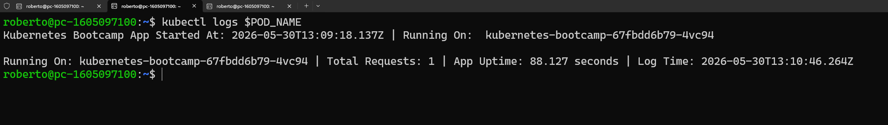

```bash
kubectl proxy
```

Levanta un proxy HTTP en `localhost:8001` que autentica y reenvía las peticiones a la API de Kubernetes, permitiendo acceder a los pods sin exponer un servicio.

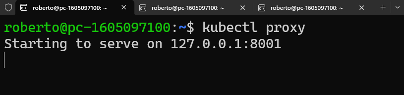

```bash
curl http://localhost:8001/api/v1/namespaces/default/pods/$POD_NAME:8080/proxy/
```

Accede directamente al pod a través del proxy de la API, sin necesidad de exponerlo como servicio. Útil para depuración.

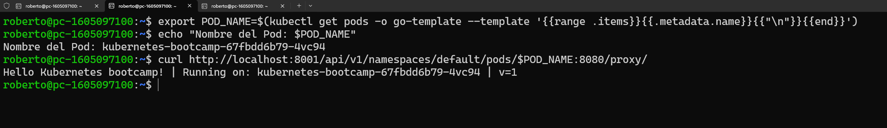

---

### 4. Inspeccionar con describe y exec

```bash
kubectl describe pods
```

Muestra información detallada del pod: imagen, nodo asignado, IPs, eventos recientes y estado de los contenedores. Clave para diagnosticar problemas.

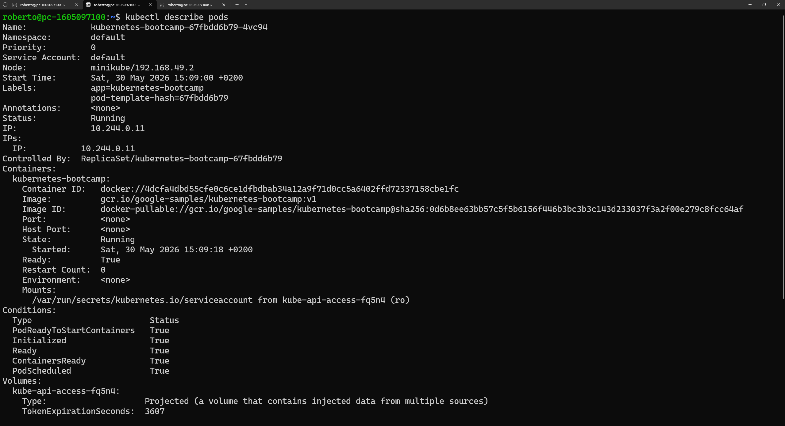

```bash
kubectl exec "$POD_NAME" -- env
kubectl exec -ti $POD_NAME -- bash
```

`exec -- env` lista las variables de entorno inyectadas en el contenedor. `exec -ti -- bash` abre una shell interactiva dentro del pod, equivalente a un `docker exec`.

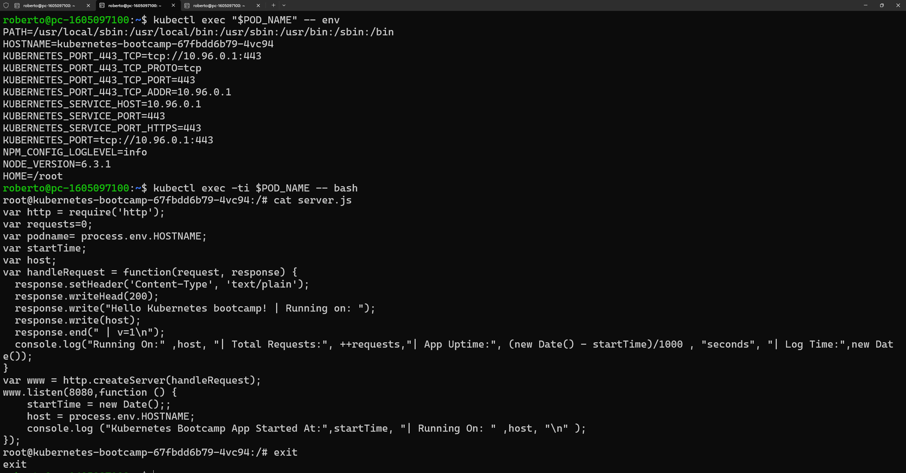

---

### 5. Exponer como servicio NodePort

```bash
kubectl expose deployment/kubernetes-bootcamp \
  --type="NodePort" --port 8080
kubectl get services
minikube service kubernetes-bootcamp --url
```

`NodePort` asigna un puerto estático en el nodo (rango 30000-32767) que redirige tráfico al pod. En Minikube, `service --url` construye la URL completa con la IP del nodo.

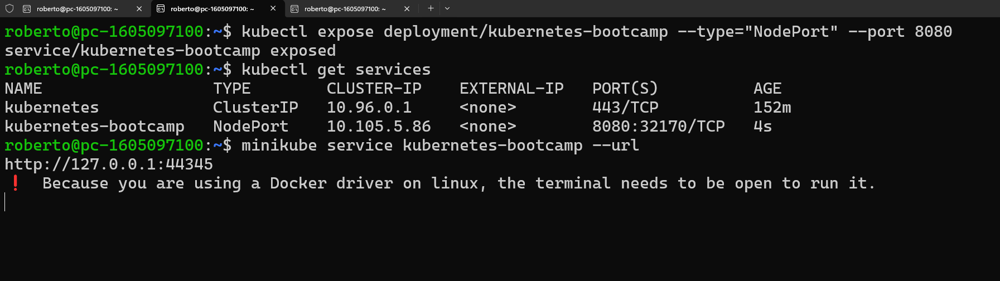

---

### 6. Escalar a 4 réplicas

```bash
kubectl scale deployments/kubernetes-bootcamp --replicas=4
kubectl get pods -o wide
```

Kubernetes crea 3 pods adicionales y los distribuye entre los nodos disponibles. `-o wide` añade las columnas de IP y nodo para ver la distribución.

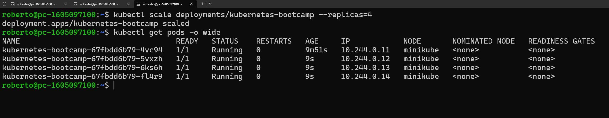

El servicio balancea automáticamente las peticiones entre los 4 pods. Cada respuesta identifica el pod que la atendió.

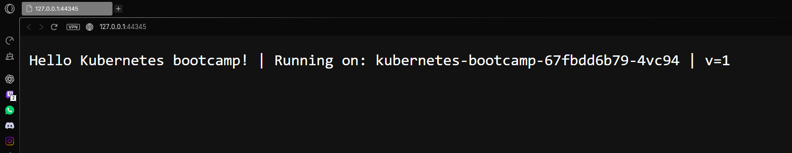

---

### 7. Addon metrics-server

```bash
minikube addons enable metrics-server
kubectl get pod,svc -n kube-system
```

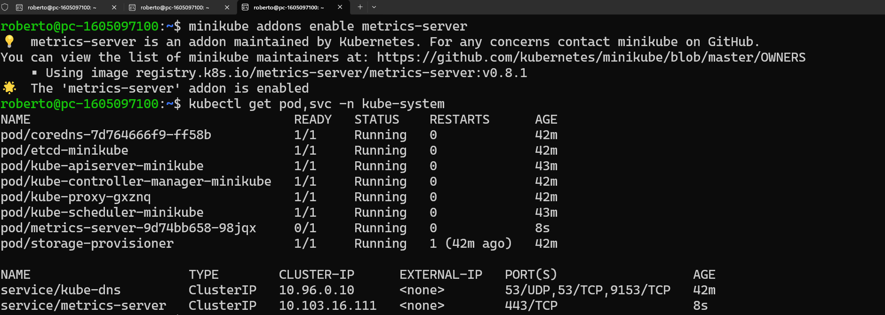

---

### 8. Rolling update a v2

```bash
kubectl set image deployments/kubernetes-bootcamp \
  kubernetes-bootcamp=docker.io/jocatalin/kubernetes-bootcamp:v2
kubectl rollout status deployments/kubernetes-bootcamp
```

Kubernetes sustituye los pods gradualmente (sin downtime), creando nuevos con la imagen v2 antes de terminar los v1. `rollout status` hace seguimiento en tiempo real.

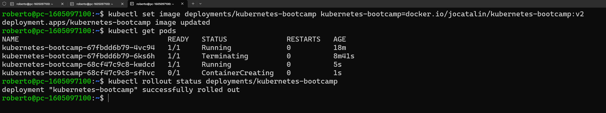

---

### 9. Simular fallo con imagen inexistente

```bash
kubectl set image deployments/kubernetes-bootcamp \
  kubernetes-bootcamp=gcr.io/google-samples/kubernetes-bootcamp:v10
kubectl get pods
```

La imagen `v10` no existe, por lo que los pods nuevos quedan en `ErrImagePull`. Kubernetes mantiene los pods anteriores activos, garantizando que el servicio no cae.

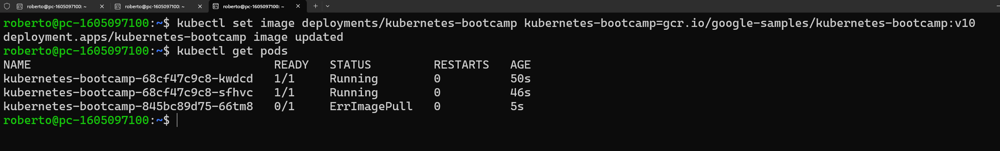

---

### 10. Rollback a v1

```bash
kubectl rollout undo deployments/kubernetes-bootcamp
kubectl get pods
```

`rollout undo` revierte al estado anterior del Deployment. Kubernetes vuelve a aplicar el proceso de rolling update, esta vez en sentido inverso.

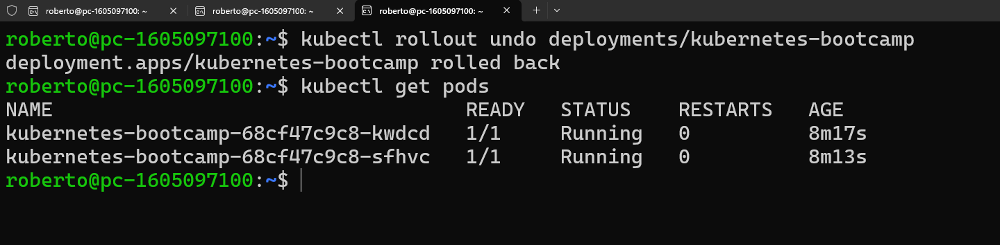

---

### 11. Limpieza

```bash
kubectl delete deployments/kubernetes-bootcamp services/kubernetes-bootcamp
minikube stop
```

Elimina los recursos creados durante la práctica y apaga el nodo de Minikube liberando los recursos del host.

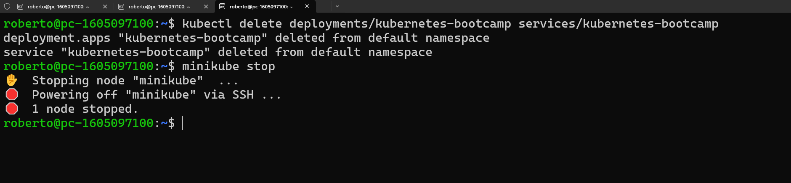

---

## Práctica 3 · PoC K3s HA Cluster

> Despliegue de un clúster K3s en alta disponibilidad con arquitectura híbrida: nodo maestro nativo sobre Ubuntu y nodos worker en contenedores Docker. Stack completo con Prometheus, Grafana, Vault y una aplicación Flask + Redis distribuida.

---

### Estructura del proyecto

```text
PoC/
├── assets/
├── app/
│   ├── app.py            # Aplicación Flask con contador de visitas via Redis
│   ├── requirements.txt
│   └── Dockerfile
└── manifests/
    ├── redis.yaml        # Deployment + Service de Redis
    └── app.yaml          # Deployment (3 réplicas) + Service de la app
```

---

### 1. Inicializar el nodo maestro nativo

```bash
curl -sfL https://get.k3s.io | sh -s - server \
  --cluster-init \
  --tls-san 172.17.0.1 \
  --tls-san 172.21.22.249
```

`--cluster-init` habilita etcd embebido para soporte HA. Los flags `--tls-san` añaden IPs adicionales al certificado TLS del servidor, necesario para que los agentes remotos puedan conectarse sin errores de certificado.

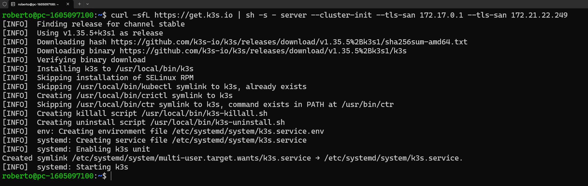

---

### 2. Verificar el clúster híbrido

```bash
sudo k3s kubectl get nodes
docker ps -a
```

Muestra los 4 nodos del clúster: el maestro nativo (`pc-1605097100`) y los tres nodos Docker (`k3s-master-2`, `k3s-worker-1`, `k3s-worker-2`), todos en estado `Ready`.

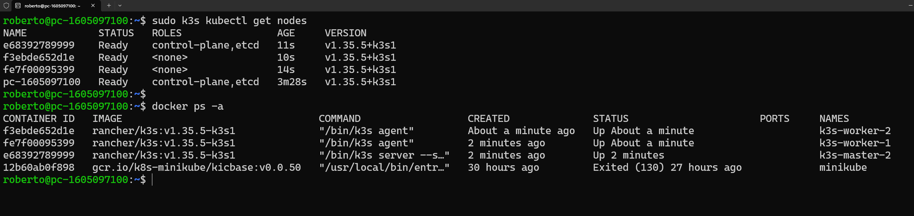

---

### 3. Instalar Helm

```bash
curl -fsSL -o get_helm.sh \
  https://raw.githubusercontent.com/helm/helm/main/scripts/get-helm-3
chmod 700 get_helm.sh
./get_helm.sh
```

Helm es el gestor de paquetes de Kubernetes. Permite instalar aplicaciones complejas como Prometheus o Vault con un solo comando, gestionando todas sus dependencias y configuraciones.

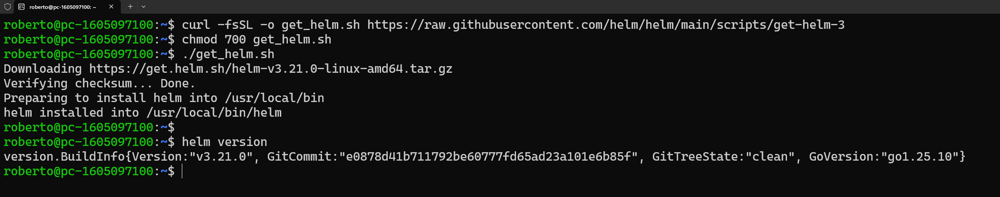

---

### 4. Prometheus + Grafana

```bash
helm repo add prometheus-community \
  https://prometheus-community.github.io/helm-charts
helm repo update
helm install monitoring prometheus-community/kube-prometheus-stack \
  -n monitoring --create-namespace \
  --set grafana.adminPassword=admin
```

El chart `kube-prometheus-stack` instala Prometheus, Grafana y varios exportadores de métricas de una vez. En WSL2, el exportador de nodos genera conflictos con las interfaces de red del host, por lo que se desactiva:

```bash
helm upgrade monitoring prometheus-community/kube-prometheus-stack \
  -n monitoring \
  --set grafana.adminPassword="admin" \
  --set prometheus-node-exporter.enabled=false \
  --set nodeExporter.enabled=false
```

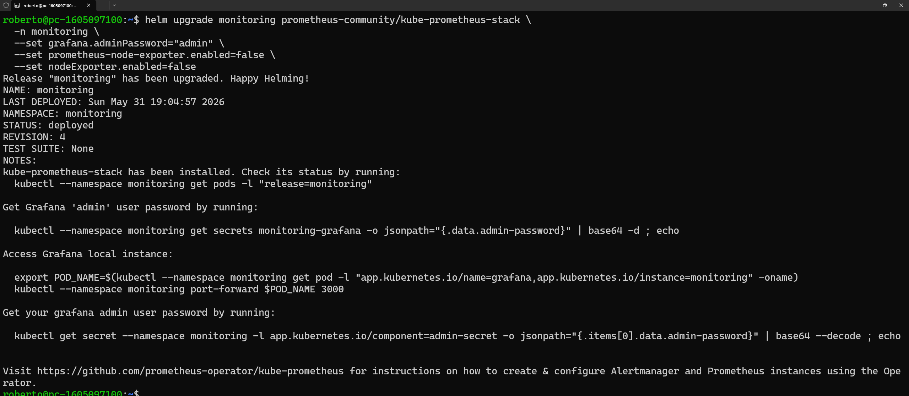

```bash
kubectl port-forward svc/monitoring-grafana 3000:80 -n monitoring
# http://localhost:3000  |  admin / admin
```

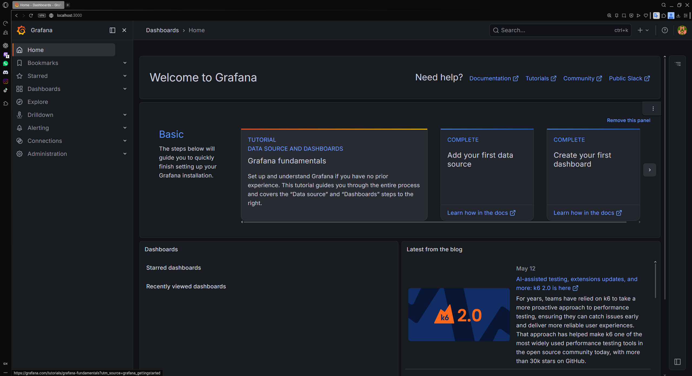

---

### 5. Vault

```bash
helm repo add hashicorp https://helm.releases.hashicorp.com
helm install vault hashicorp/vault -n vault --create-namespace \
  --set "server.dev.enabled=true"
kubectl port-forward svc/vault 8200:8200 -n vault
# http://localhost:8200  |  Token: root
```

El modo `dev` levanta Vault sin cifrado en disco ni autenticación compleja, ideal para laboratorio. Los motores de secretos `cubbyhole` y `secret` quedan disponibles desde el primer arranque.

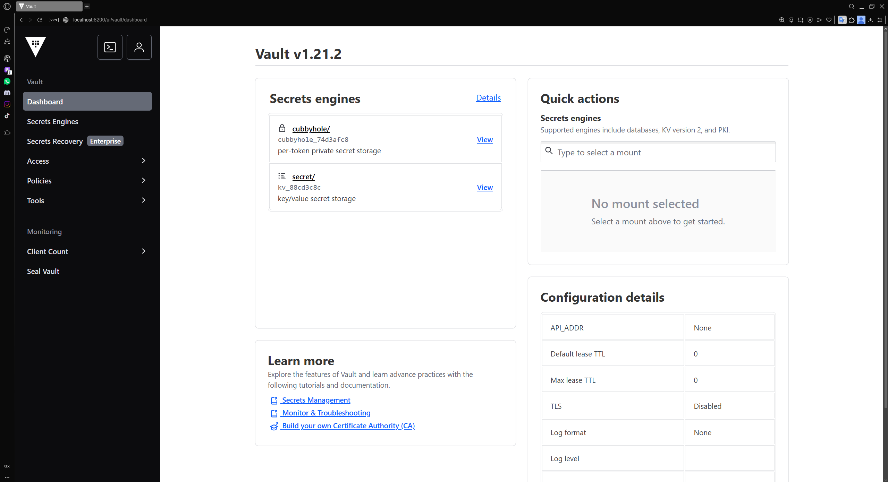

---

### 6. Sideloading de imágenes en los nodos

```bash
docker save friendlyhello:latest | docker exec -i k3s-master-2 ctr -n k8s.io images import -
docker save friendlyhello:latest | docker exec -i k3s-worker-1 ctr -n k8s.io images import -
docker save friendlyhello:latest | docker exec -i k3s-worker-2 ctr -n k8s.io images import -
```

K3s usa `containerd` con su propio socket, aislado del daemon de Docker del host. La imagen construida localmente no es visible para el runtime del clúster, así que se serializa con `docker save` y se importa directamente en el namespace `k8s.io` de cada nodo vía pipe.

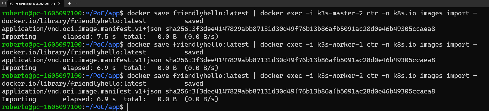

---

### 7. Despliegue de la aplicación

```bash
kubectl apply -f ~/PoC/manifests/redis.yaml
kubectl apply -f ~/PoC/manifests/app.yaml
```

`apply` aplica los manifiestos de forma declarativa: crea los recursos si no existen o los actualiza si han cambiado. El servicio `friendlyhello` queda expuesto en el puerto 80.

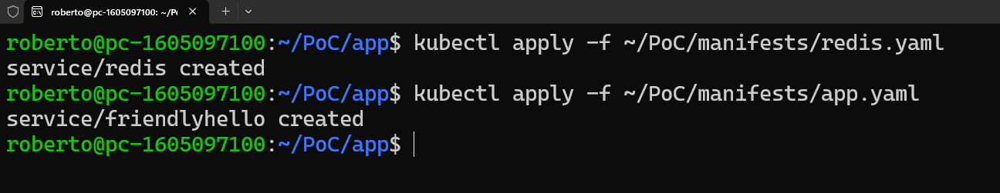

```bash
kubectl port-forward svc/friendlyhello 8081:80
# http://localhost:8081
```

El contador de visitas incrementa con cada recarga, demostrando que Flask persiste el estado en Redis correctamente a través de la red interna del clúster.

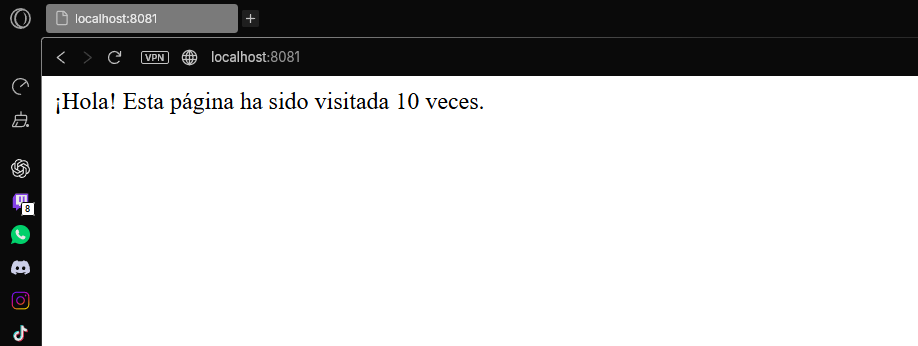

---

### 8. Observación del clúster con K9s

```bash
k9s
# Pulsar 0 para ver todos los namespaces
```

K9s es una TUI (interfaz de terminal) para Kubernetes que permite navegar recursos, ver logs y ejecutar comandos sin escribir `kubectl` constantemente. La vista de todos los namespaces muestra los 21 pods del stack completo corriendo sin reinicios.

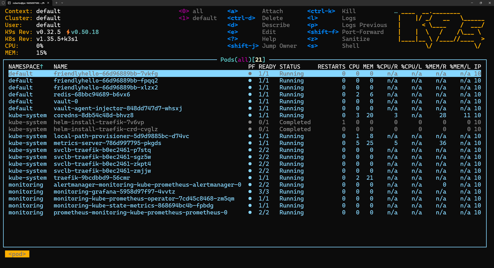

---

## Anexo · Deploy alternativo con k3d

> Mismo stack que la Práctica 3 pero desplegado con k3d, que automatiza la creación del clúster HA en un solo comando. Permite reproducir el entorno completo sin configuración manual de nodos.

---

### Diferencia respecto a la Práctica 3

| | Práctica 3 | Anexo k3d |
|---|---|---|
| Nodo maestro | Nativo sobre Ubuntu | Contenedor Docker |
| Configuración | Manual, nodo a nodo | Un solo comando |
| TLS/SAN | Configuración explícita | Gestionado por k3d |
| Reproducibilidad | Requiere setup previo | Plug & play |

---

### Requisitos

```bash
curl -s https://raw.githubusercontent.com/k3d-io/k3d/main/install.sh | bash
k3d version
```

---

### 1. Crear el clúster HA

```bash
k3d cluster create k3s-lab \
  --servers 2 \
  --agents 2 \
  --wait
```

`--servers 2` levanta 2 nodos de control plane con etcd embebido. `--agents 2` añade 2 workers. `--wait` bloquea hasta que todos los nodos están `Ready`.

```bash
kubectl get nodes -o wide
```

---

### 2. Prometheus + Grafana

```bash
helm repo add prometheus-community https://prometheus-community.github.io/helm-charts
helm repo update
helm install monitoring prometheus-community/kube-prometheus-stack \
  -n monitoring --create-namespace \
  --set grafana.adminPassword=admin
kubectl wait --for=condition=ready pod --all -n monitoring --timeout=180s
kubectl port-forward svc/monitoring-grafana 3000:80 -n monitoring
# http://localhost:3000  |  admin / admin
```

---

### 3. Vault

```bash
helm repo add hashicorp https://helm.releases.hashicorp.com
helm install vault hashicorp/vault \
  -n vault --create-namespace \
  --set "server.dev.enabled=true"
kubectl wait --for=condition=ready pod \
  -l app.kubernetes.io/name=vault -n vault --timeout=120s
kubectl port-forward svc/vault 8200:8200 -n vault
# http://localhost:8200  |  Token: root
```

---

### 4. Despliegue de la aplicación

A diferencia de la Práctica 3, con k3d no es necesario el sideloading manual mediante pipes. k3d importa la imagen directamente en todos los nodos del clúster:

```bash
k3d image import friendlyhello:latest -c k3s-lab
```

```bash
kubectl apply -f ~/PoC/manifests/redis.yaml
kubectl apply -f ~/PoC/manifests/app.yaml
kubectl wait --for=condition=available deployment/redis deployment/friendlyhello \
  --timeout=60s
kubectl port-forward svc/friendlyhello 8081:80
# http://localhost:8081
```

---

### 5. Observación con K9s

```bash
k9s
# Pulsar 0 para ver todos los namespaces
```

---

### Limpieza

```bash
k3d cluster delete k3s-lab
```

Elimina todos los contenedores, volúmenes y configuración del clúster en un solo comando.